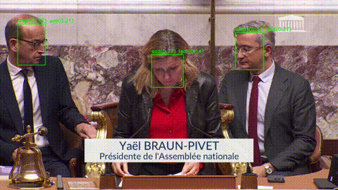
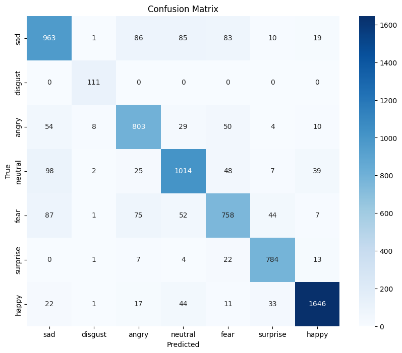

# Assembl-IA-streamlit

## Analyse textuelle

## Analyse audio

## Analyse vidéo

## Présentation

Il s'agit d'un gif, la vidéo au format .mp4 est disponible dans le dossier output




## 🚀 Fonctionnalités

- ✅ Lecture vidéo frame par frame
- ✅ Détection des visages
- ✅ Si visage assez grand → Détection des émotions (les 2 classes majoritaires)
- ✅ Annotation des résultats sur la vidéo en output
- ❌Création d'un timeline (fichier JSON/CSV avec timestamps et émotions)
- ❌Graphique émotionnel temporel

## 🤖 Modèles utilisés

- YOLO v8 : 
🔗 https://yolov8.com/

- facial_emotions_image_detection : 
🔗 https://huggingface.co/dima806/facial_emotions_image_detection

## 📈 Evaluation des modèles 

- utilisation du dataset de test suivant :
🔗 https://www.kaggle.com/datasets/ananthu017/emotion-detection-fer

- resultats : 
<p align="center">
  
</p>

```text
precision globale =  0.846893285037615

précision sur angry =  0.7722534081796311
précision sur disgust =  1.0
précision sur fear =  0.8382045929018789
précision sur happy =  0.8223844282238443
précision sur neutral =  0.740234375
précision sur sad =  0.9434416365824309
précision sur surprise =  0.9278466741826381
```

