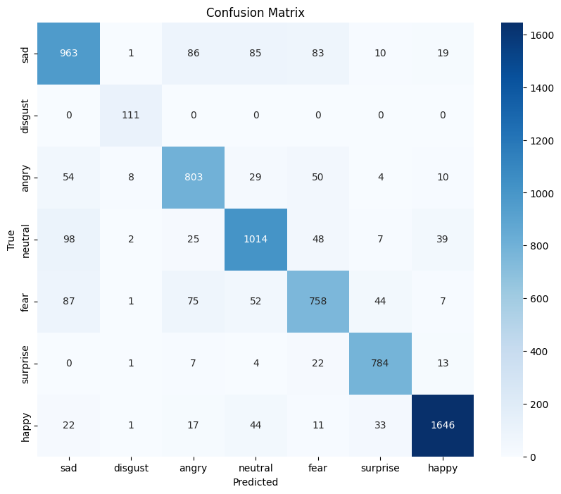
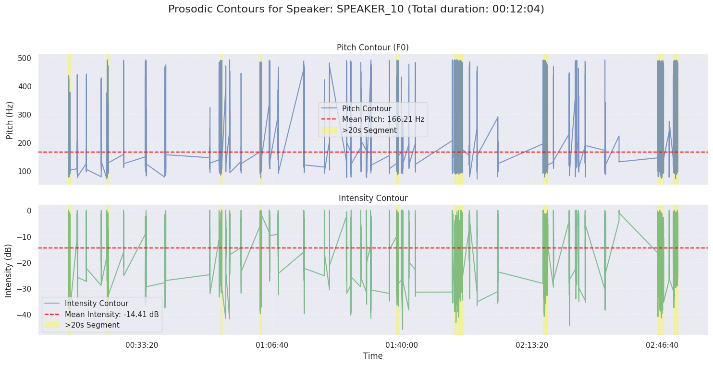
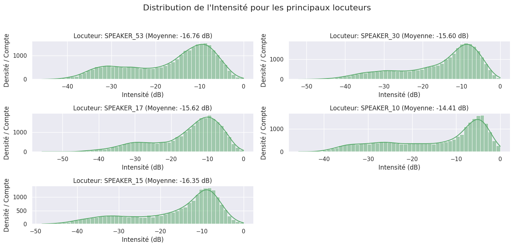
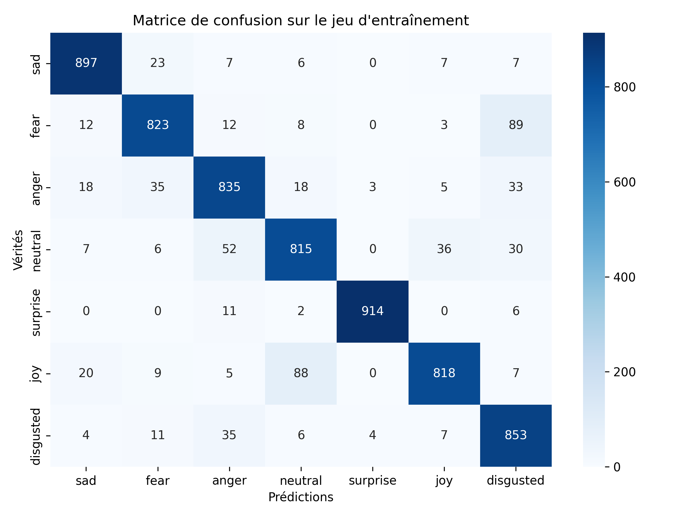

# Assembl-IA

> ⚠️ *Ce projet vise avant tout à mettre en place d’une pipeline Azure et l'utilisation de modèles de machine learning. Les résultats obtenus sont présentés à titre illustratif et ne feront l’objet d’aucun commentaire politique ou d'interprétation ici.*

Ce projet a pour but de capter les stratégies rhétoriques, entendues comme les techniques d'expression et de communication, mises en œuvre par les députés actifs lors des séances parlementaires.   

Pour ce faire notre équipe s'est orientée vers la pipeline Azure suivante :  

L'interface utilisateur est accessible via le lien : 
https://assemblia-backend.azurewebsites.net/informations

## Job 0 : Webscrapping 

Dans le dossier dag se trouvent deux fichiers python permettant de récupérer :  
- les dernières vidéos de l'asssemblée nationale au format .mp4  
- les derniers comptes-rendus de séances au format .xml  

Ces fichiers sont stockés dans le blob storage Azure et servent d'input pour les différents jobs ci-dessous.  
   
## Job 1 : Analyse vidéo  
  
#### Présentation  

Ce job permet de traiter la vidéo la plus récente récupérée suite au webscrapping.  

#### Fonctionnalités

- Lecture vidéo frame par frame
- Détection des visages
- Si visage assez grand → Détection des émotions (les 2 classes majoritaires)
- Annotation des résultats sur la vidéo en output
- Création d'un timeline (fichier CSV)

#### Pipeline Azure

- Lecture des variables d'environnement contenues dans les paramètres du job databricks
- Récupération de la dernière vidéo présente sur le blob storage
- Traitement
- Enregistrement de la vidéo annotée et de la timeline dans le blob storage
- Enregistrement de la timeline dans postgres

#### Démo GIF 

Il s'agit d'un gif, la vidéo au format .mp4 est disponible dans le dossier output

#### Modèles utilisés

- YOLO v8 : 
https://yolov8.com/

- facial_emotions_image_detection : 
  https://huggingface.co/dima806/facial_emotions_image_detection

#### Evaluation des modèles 

- utilisation du dataset de test suivant :
https://www.kaggle.com/datasets/ananthu017/emotion-detection-fer

- resultats : 

  
| Emotion   | Précision |
|-----------|-----------|
| Angry     | 0.772     |
| Disgust   | 1.000     |
| Fear      | 0.838     |
| Happy     | 0.822     |
| Neutral   | 0.740     |
| Sad       | 0.943     |
| Surprise  | 0.928     |

Précision globale : **0.847**

## Job 2 : Analyse audio

#### Introduction
Ce projet met en œuvre un pipeline complet d'analyse audio, axé sur l'extraction et l'étude des caractéristiques prosodiques du langage parlé, ainsi que sur la diarisation des locuteurs. L'objectif est de fournir des informations détaillées sur "qui a parlé quand" et "comment" (en termes de hauteur et d'intensité de la voix), facilitant ainsi une compréhension approfondie des interactions vocales.

#### Objectifs de l'Analyse
Notre analyse audio vise à atteindre les objectifs suivants :

* **Compter le nombre de locuteurs** distincts présents dans un enregistrement audio.
* Réaliser la **Diarisation des Locuteurs** : identifier précisément les segments où chaque locuteur a pris la parole (déterminer "qui a parlé quand").
* Extraire et analyser l'**Intensité** (volume sonore) de la voix pour chaque locuteur.
* Extraire et analyser le **Pitch (F0)** (fréquence fondamentale / hauteur de la voix) pour chaque locuteur.
* Générer une **Timeline de Prise de Parole** : visualiser graphiquement les périodes d'activité vocale de chaque participant.

#### Méthodologie

Le pipeline d'analyse est structuré en plusieurs étapes clés :

1.  **Chargement et Préparation des Données :**
    * **Audio :** L'enregistrement audio est chargé à l'aide de la bibliothèque `librosa`, garantissant une fréquence d'échantillonnage et un format mono cohérents pour l'analyse.
    * **Diarisation (via XML) :** Les segments de prise de parole des locuteurs sont importés depuis un fichier XML (avec une structure prédéfinie ` <segment start="..." end="..." speaker="..."/>`). Ces données sont ensuite traitées pour être utilisées dans l'analyse.

2.  **Conversion au Format RTTM :**
    * Les informations de diarisation extraites du fichier XML peuvent être converties et exportées au format standard **RTTM** (Rich Transcription Time Marked). Ce format est largement utilisé dans le domaine du traitement de la parole pour représenter les segments de locuteurs, facilitant l'interopérabilité et l'évaluation.

3.  **Extraction des Caractéristiques Prosodiques :**
    * Pour chaque segment de parole identifié par la diarisation, les caractéristiques prosodiques suivantes sont extraites :
        * **Pitch (F0) :** La fréquence fondamentale de la voix est calculée en utilisant `librosa.core.piptrack`. Des filtres sont appliqués pour assurer la fiabilité des mesures de pitch (en excluant les valeurs avec une faible magnitude).
        * **Intensité :** L'énergie RMS (Root Mean Square) est calculée via `librosa.feature.rms` et convertie en décibels (dB), fournissant une mesure du volume sonore.
    * Ces caractéristiques sont extraites sous forme de **contours temporels** (l'évolution des valeurs au fil du temps) et de données brutes pour des analyses statistiques.

4.  **Analyse et Agrégation des Données :**
    * Les données de pitch et d'intensité sont regroupées par locuteur.
    * Des statistiques descriptives clés (moyenne, médiane, écart-type) pour le pitch et l'intensité sont calculées pour chaque locuteur.
    * La durée totale de parole de chaque locuteur est comptabilisée pour évaluer leur contribution.

#### Sorties et Visualisation

Le projet génère plusieurs types de sorties, principalement sous forme de fichiers CSV pour faciliter l'intégration avec des outils de visualisation ou d'analyse externe :

* **Fichier RTTM** (`.rttm`) : Diarisation des locuteurs au format standard.
* **Timeline des Locuteurs** (`timeline_data.csv`) : Un fichier CSV détaillant chaque segment de parole avec `speaker_label`, `start`, `duration` et `end`. Pour faciliter l'affichage graphique, une sélection des locuteurs les plus actifs (par exemple, le top 5) est généralement privilégiée pour la visualisation directe, mais toutes les données sont disponibles dans ce fichier.
* **Distributions Prosodiques** (`prosody_stats.csv`) : Un fichier CSV récapitulant les statistiques clés (moyenne, médiane, écart-type) du pitch et de l'intensité pour chaque locuteur.
* **Contours de Pitch** (`pitch_contours.csv`) : Un fichier CSV contenant les données de séries temporelles pour le contour de pitch (`speaker_label`, `time_s`, `pitch_hz`).
* **Contours d'Intensité** (`intensity_contours.csv`) : Un fichier CSV contenant les données de séries temporelles pour le contour d'intensité (`speaker_label`, `time_s`, `intensity_db`).

Des fonctions de traçage sont également incluses pour générer des représentations visuelles (diagrammes de timeline, histogrammes de distribution, tracés de contours) directement si nécessaire.

#### Utilisation (Conceptuel)

Pour utiliser ce pipeline, vous devrez généralement :

1.  Avoir un fichier audio (ex: `.wav`).
2.  Disposer d'un fichier XML de retranscription associé.
3.  Exécuter la classe d'analyse fournie en lui passant ces fichiers en entrée.
4.  Les fichiers de sortie CSV seront générés dans le répertoire spécifié (par défaut `./output/`).

#### Analyse Interactive et Visualisations

Pour une exploration interactive des données et la visualisation des différentes sorties graphiques (timeline, contours de pitch et d'intensité, distributions), un **Notebook Jupyter** est fourni :

* **`audio_analysis.ipynb`** : Ce notebook contient le code pas à pas qui génère les données exportées et illustre comment créer les différents graphiques mentionnés (timeline, contours, distributions de pitch et d'intensité) à partir de ces données. Il sert de guide pratique pour comprendre le fonctionnement de l'analyse et interpréter les résultats visuellement.

## Job 3 : Analyse textuelle

#### Présentation

Cette brique du projet vise à **détecter les émotions dans des textes en français** (transcriptions audio, commentaires, scripts, etc.).  
Afin d’aligner la sortie textuelle sur l’axe visuel, nous couvrons **7 émotions** : Tristesse (`sad`), Peur (`fear`), Colère (`anger`), Neutre (`neutral`), Surprise (`surprise`), Joie (`joy`) et Dégoût (`disgusted`).

#### Fonctionnalités

- Pré-traitement complet du texte (nettoyage, normalisation, tokenisation)
- Classification des émotions sur 7 classes
- Export CSV contenant : timestamp, texte original, émotion prédite, score de confiance
- Intégration directe dans la pipeline Azure (Databricks + Blob Storage + Postgres)

#### Pipeline Azure

1. Lecture des fichiers texte ou transcriptions stockés dans le **Blob Storage**  
2. **Databricks** appelle le notebook de prédiction NLP  
3. Les prédictions sont :
   - stockées au format CSV dans le Blob Storage (dossier *output*)  
   - insérées dans **Postgres** pour exploitation BI  
4. Les métriques d’exécution (latence, nombre de tokens) sont remontées à **Azure Application Insights**

#### Modèle utilisé

| Nom | Base | Type | Lien |
|-----|------|------|------|
| `assembl-ia/french_emotion_camembert-7cls` | CamemBERT-base | Fine-tune (7 émotions) | [Hugging Face (original)](https://huggingface.co/astrosbd/french_emotion_camembert) |

- **Fine-tuning** réalisé sur un jeu de données équilibré de **5 033 phrases** (719 exemples/émotion).  
- **Epochs** : 5   •  **Batch size** : 16   •  **LR** : 2e-5

#### Données d’entraînement

| Source | Langue | Taille | Particularité |
|--------|--------|--------|---------------|
| **EMODIFT** | FR | 3 194 | Annoté manuellement |
| **TPM-28 / emotion-FR** | FR | 1 839 | Contient la classe *Dégoût* |

Les deux jeux ont été fusionnés puis ré-équilibrés pour obtenir exactement **719 exemples / classe**.

#### Évaluation du modèle

| Emotion   | Précision |
|-----------|-----------|
| Angry     | 0.87      |
| Disgust   | 0.83      |
| Fear      | 0.91      |
| Happy     | 0.93      |
| Neutral   | 0.86      |
| Sad       | 0.94      |
| Surprise  | 0.99      |

**Précision globale** : **0.90**

> Le score de 90 % sur le set de test confirme l’intérêt du fine-tuning pour ajouter la classe *Dégoût* (vs 82 % avant adaptation).

## Informations légales et sources

Ce projet vise avant tout à mettre en place un pipeline Azure ainsi qu'à expérimenter l’utilisation de modèles de machine learning.
Les résultats présentés sont illustratifs et ne font l’objet d’aucun commentaire politique ni d’interprétation.
Nous utilisons, adaptons et exploitons des données sous Licence Ouverte mises à disposition par l’Assemblée nationale :

- [data.assemblee-nationale.fr](https://data.assemblee-nationale.fr)
- [videos.assemblee-nationale.fr](https://videos.assemblee-nationale.fr)

**La responsabilité de l’Assemblée nationale ne saurait être engagée en cas d’erreur**
(cf. [data.gouv.fr](https://www.data.gouv.fr/fr/licences-etalab/))

Dernière mise à jour : 22 juin 2025
